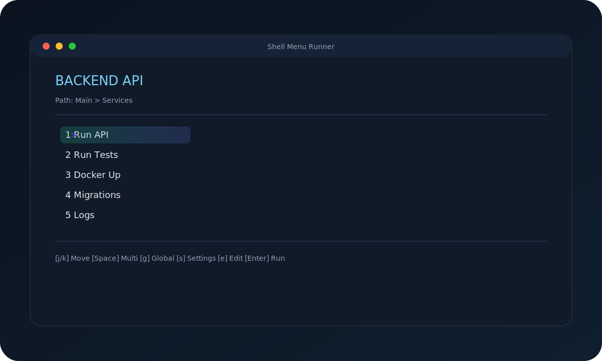

# 🚀 Shell Menu Runner

  

[English](#english) | [Deutsch](#deutsch)

<a name="english"></a>

## 🇺🇸 English

**The Ultimate Task Runner for the Terminal.**
Version 1.3.0 (Sub-Menus & Dropdown-Selects). Zero config, Zero dependencies. Runs on Linux and macOS.

### 📸 Screenshot



### ✨ Feature Summary

**1) 🧠 Smart Project Detection (Smart Init)**

- **Node.js / React:** Scans `package.json` and imports scripts as tasks.
- **Docker:** Detects `docker-compose.yml` and offers `up` / `down` tasks.
- **Python:** Detects `manage.py` (Django) or `main.py` and creates run tasks.

**2) 🌍 Global & Local Mode**

- **Project Tasks:** Uses a local `.tasks` file per project.
- **System Tasks:** Switch with `g` to the global `~/.tasks` menu.
- **Auto Search:** Walks upwards to find the nearest `.tasks` file.
- **Repo Default:** This repo ships with a starter `.tasks` you can edit.

**3) 🛠 Dynamic Interaction & Inputs**

- **Text Inputs:** Use `<<Name>>` placeholders and get prompted at runtime.
- **Dropdown-Selects:** Use `<<Select:Option1,Option2>>` for interactive dropdown menus.
- **Environment Files:** Loads a local `.env` before executing a task.

**4) � Sub-Menus & Navigation**

- **Sub-Menus:** Organize complex tasks with LEVEL|NAME|SUB|DESC format.
- **BACK:** Navigate back to parent menu with breadcrumb history displayed.
- **Breadcrumbs:** Visual path showing menu hierarchy (e.g., Main > Database > Migrations).

**5) �🛡 Safety & Control**

- **Confirmation:** `[!]` in the description forces an explicit confirmation.
- **Multi-Select (UI):** Mark items with Space (execution remains single-item).

**5) 🎨 UI & UX**

- **Themes:** CYBER / MONO via `# THEME:`.
- **Settings Menu:** Press `s` to configure theme, columns, and language (stored in `.runrc`).
- **Live Filter:** Press `/` to filter by name.
- **Navigation:** Arrow keys (↑↓←→) or `j`/`k`/`h`/`l` (vim-style); horizontal navigation between columns.
- **Multi-Select:** Mark items with Space, execution runs all marked tasks in order on Enter.

**7) 🔌 Integrations**

- **Zsh Widget:** Open the menu with `Ctrl+O`.
- **Raycast & Alfred:** macOS integrations via scripts in `integrations/`.

**8) 🔄 Maintenance & Installation**

- **Self-Update:** `run --update` downloads the latest version.
- **Magic Installer:** One-liner installer via `install.sh`.
- **Integrity Check (optional):** Set `RUN_EXPECTED_SHA256=<hash>` before `run --update` to verify the downloaded script.
- Without `RUN_EXPECTED_SHA256`, `run --update` asks for confirmation before applying the download.
- Recommended hash for v1.3.0: (TBD after v1.3.0 release).

**9) 🔒 Security Notes**

- Script runs with `set -euo pipefail` for safer defaults; unexpected errors stop execution.
- Installer falls back to `$HOME/.local/bin` if `/usr/local/bin` is not writable; add it to `PATH` when prompted.
- Use `RUN_EXPECTED_SHA256` with `run --update` to pin the downloaded script hash.

**Planned / Roadmap**

- Terraform detection, dropdown selects (`<<Select:A,B>>`), batch execution of multi-select,
  sub-menus (`SUB`/`BACK`), shell completions, Homebrew tap, and CI checks.

### 📦 Installation

**The Magic One-Liner:**
Installs the runner and sets up Zsh autocomplete & Raycast scripts automatically.

```bash
/bin/bash -c "$(curl -fsSL https://raw.githubusercontent.com/MarioPeters/shell-menu-runner/main/install.sh)"
```

### ⚙️ Configuration (.tasks)

Format: `LEVEL|NAME|CMD|DESC`

```text
# THEME: CYBER
# TITLE: Backend API
VAR_PORT=8080

0|🚀 Deploy|./deploy.sh --port $VAR_PORT|Deploy App
0|📝 Commit|git commit -m "<<Commit Message>>"|Interactive Input
0|🧹 Clean|rm -rf ./tmp|[!] Requires Confirmation
0|🐳 Docker|SUB|Submenu
1|Logs|docker logs -f|View Logs
1|Back|BACK
```

### ⚙️ Settings (.runrc)

Settings can be saved globally (`~/.runrc`) or per project (`.runrc`). Local settings override global.

```text
# Shell Menu Runner Settings
THEME=CYBER
LANG=EN
COLS_MIN=1
COLS_MAX=3
```

### 🔌 Integrations

#### VS Code

Add a task in `.vscode/tasks.json` to run via `Cmd+Shift+B`:

```json
{
  "version": "2.0.0",
  "tasks": [
    {
      "label": "Run Menu",
      "type": "shell",
      "command": "run",
      "group": { "kind": "build", "isDefault": true },
      "presentation": { "focus": true, "panel": "dedicated" }
    }
  ]
}
```

#### Raycast & Alfred

Use the included scripts in `integrations/` to launch the runner in the current Finder folder. The installer sets this up for Raycast automatically.

#### Zsh Widget

Press `Ctrl+O` to open the menu instantly (setup by installer).

### 🗑️ Uninstall

```bash
rm /usr/local/bin/run
```

### 🔧 Development

This repo includes an automated release script with interactive menu:

```bash
./scripts/release.sh          # Interactive menu
./scripts/release.sh --dry-run  # Direct dry-run mode
./scripts/release.sh --release  # Direct release mode
./scripts/release.sh --help     # Show usage
```

The script handles version bumping, SHA256 computation, auto-generates CHANGELOG from git commits (opens editor for review), and git operations.

**Note:** Python3 is only required for the release process (maintainer only), not for end users.

### 🤝 Contributing

Pull requests are welcome! Please run `shellcheck` before submitting.

---

<a name="deutsch"></a>

## 🇩🇪 Deutsch

**Die Kommandozentrale für dein Terminal.**
Version 1.2.0 (Gold Master). Vereint Entwicklung, DevOps und System-Administration.

### 📸 Screenshot


### ✨ Feature-Zusammenfassung

**1) 🧠 Intelligente Projekt-Erkennung (Smart Init)**

- **Node.js / React:** Scannt die `package.json` und importiert Scripts als Tasks.
- **Docker:** Erkennt `docker-compose.yml` und bietet `up` / `down` Tasks an.
- **Python:** Erkennt `manage.py` (Django) oder `main.py` und erstellt Start-Tasks.

**2) 🌍 Globaler & Lokaler Modus**

- **Projekt-Tasks:** Nutzt eine lokale `.tasks` pro Projekt.
- **System-Tasks:** Wechsel mit `g` ins globale Menü `~/.tasks`.
- **Auto-Suche:** Sucht beim Start nach oben die nächste `.tasks`.
- **Repo-Standard:** Dieses Repo enthaelt eine Start-`.tasks`, die du anpassen kannst.

**3) 🛠 Dynamische Interaktion & Eingaben**

- **Text-Eingaben:** `<<Name>>` wird zur Laufzeit abgefragt.
- **Umgebungsdatei:** Lädt eine lokale `.env` vor der Ausführung.

**4) 🛡 Sicherheit & Kontrolle**

- **Bestätigung:** `[!]` in der Beschreibung erzwingt eine Bestätigung.
- **Multi-Select (UI):** Markieren per Leertaste (Ausführung bleibt einzeln).

**5) 🎨 UI & UX**

- **Themes:** CYBER / MONO via `# THEME:`.
- **Einstellungen:** Mit `s` lassen sich Theme, Spalten und Sprache konfigurieren (gespeichert in `.runrc`).
- **Echtzeit-Filter:** `/` filtert nach Namen.
- **Navigation:** Pfeiltasten (↑↓←→) oder `j`/`k`/`h`/`l` (Vim-Stil); horizontale Navigation zwischen Spalten.
- **Multi-Select:** Markieren per Leertaste.

**6) 🔌 Integrationen**

- **Zsh Widget:** Menü per `Ctrl+O` öffnen.
- **Raycast & Alfred:** macOS-Integrationen über Skripte in `integrations/`.

**7) 🔄 Wartung & Installation**

- **Self-Update:** `run --update` lädt die neueste Version.
- **Magic Installer:** Einzeiler über `install.sh`.
- **Integritätscheck (optional):** Setze `RUN_EXPECTED_SHA256=<hash>` vor `run --update`, um den Download zu verifizieren.
- Ohne `RUN_EXPECTED_SHA256` fragt `run --update` nach einer Bestätigung, bevor es das Update anwendet.
- Empfohlener Hash für v1.2.0: `f56b019f3a823642a3469e3cf8f8634a09819c1094a2c1baa1e997ae98e8364d`.

**8) 🔒 Sicherheitshinweise**

- Script läuft mit `set -euo pipefail`; unerwartete Fehler stoppen die Ausführung.
- Installer nutzt `$HOME/.local/bin`, falls `/usr/local/bin` nicht beschreibbar ist; danach ggf. in den `PATH` aufnehmen.
- Nutze `RUN_EXPECTED_SHA256`, um das Update gegen einen bekannten Hash zu prüfen.

**Geplant / Roadmap**

- Terraform-Erkennung, Dropdown-Selects (`<<Select:A,B>>`), Batch-Ausführung für Multi-Select,
  Sub-Menüs (`SUB`/`BACK`), Shell-Completion, Homebrew-Tap und CI-Checks.

### 📦 Installation

**Der magische One-Liner:**
Installiert das Tool und richtet Zsh Autocomplete sowie Raycast Skripte automatisch ein.

```bash
/bin/bash -c "$(curl -fsSL https://raw.githubusercontent.com/MarioPeters/shell-menu-runner/main/install.sh)"
```

### ⚙️ Konfiguration

```text
# THEME: CYBER
# TITLE: Backend API
VAR_PORT=8080

0|🚀 Deploy|./deploy.sh --port $VAR_PORT|Deploy App
0|📝 Commit|git commit -m "<<Nachricht>>"|Interaktive Eingabe
0|🧹 Clean|rm -rf ./tmp|[!] Erfordert Bestätigung
```

### ⚙️ Einstellungen (.runrc)

Settings koennen global (`~/.runrc`) oder pro Projekt (`.runrc`) gespeichert werden. Lokal ueberschreibt global.

```text
# Shell Menu Runner Settings
THEME=CYBER
LANG=DE
COLS_MIN=1
COLS_MAX=3
```

### 🔧 Entwicklung

Dieses Repo enthaelt ein automatisches Release-Script mit interaktivem Menue:

```bash
./scripts/release.sh          # Interaktives Menue
./scripts/release.sh --dry-run  # Direkt Dry-run Modus
./scripts/release.sh --release  # Direkt Release Modus
./scripts/release.sh --help     # Hilfe anzeigen
```

Das Script uebernimmt Version-Bumping, SHA256-Berechnung, generiert automatisch CHANGELOG aus Git-Commits (oeffnet Editor zum Review) und Git-Operationen.

**Hinweis:** Python3 wird nur fuer den Release-Prozess (Maintainer) benoetigt, nicht fuer Endnutzer.

### 🤝 Mitmachen

Pull Requests sind willkommen! Bitte nutze `shellcheck` vor dem Einreichen.

## 📝 Lizenz

MIT
