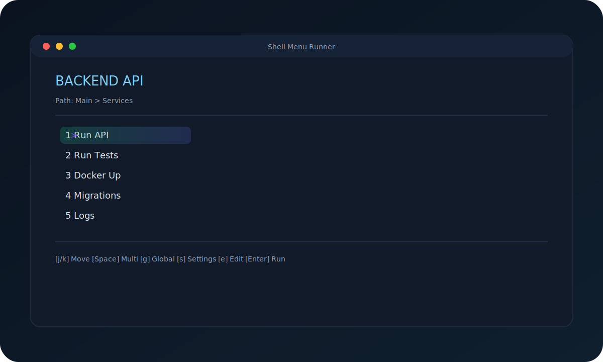

# 🚀 Shell Menu Runner

  

[English](#english) | [Deutsch](#deutsch)

<a name="english"></a>

## 🇺🇸 English

**The Ultimate Task Runner for the Terminal.**
Version 2.1.0 (Task Tags & Shell Completion). Zero config, Zero dependencies. Runs on Linux and macOS.

### 📸 Screenshot



### ✨ Feature Summary

**1) 🧠 Smart Project Detection (Smart Init)**

- **Node.js / React:** Scans `package.json` and imports scripts as tasks.
- **Docker:** Detects `compose.yml` or `docker-compose.yml` and offers `docker compose` tasks.
- **Python:** Detects `manage.py` (Django) or `main.py` and creates run tasks.
- **More stacks:** Go, Rust, Java (Maven/Gradle), PHP (Composer), Ruby (Bundler), Makefile, Poetry, Pipenv, pnpm, bun, Terraform.
- **Git/Docker profiles:** In Git/Docker repos, creates `.tasks.git` and `.tasks.docker` (use `run git`, `run docker`).
- **Install templates:** The installer creates global profile templates for: `git`, `docker`, `k8s`, `deploy`, `db`, `devops`, `server`, `nginx`, `portainer`, `mailcow`, `maint`, `monitor`, `ci`, `aws`, `test`, `lint`, `sec`, and `build`.

**2) 🌍 Global & Local Mode**

- **Project Tasks:** Uses a local `.tasks` file per project.
- **System Tasks:** Switch with `g` to the global `~/.tasks` menu.
- **Auto Search:** Walks upwards to find the nearest `.tasks` file.
- **Repo Default:** This repo ships with a starter `.tasks` you can edit.
- **Profiles:** Use `run <name>` to load `.tasks.<name>` locally or `~/.tasks.<name>` globally (e.g. `run git`, `run docker`).

**3) 🛠 Dynamic Interaction & Inputs**

- **Text Inputs:** Use `<<Name>>` placeholders and get prompted at runtime.
- **Dropdown-Selects:** Use `<<Select:Option1,Option2>>` for interactive dropdown menus.
- **Environment Files:** Loads a local `.env` before executing a task.

**4) 📋 Sub-Menus & Navigation**

- **Sub-Menus:** Organize complex tasks with LEVEL|NAME|SUB|DESC format.
- **BACK:** Navigate back to parent menu with breadcrumb history displayed.
- **Breadcrumbs:** Visual path showing menu hierarchy (e.g., Main > Database > Migrations).

**5) 🛡 Safety & Control**

- **Confirmation:** `[!]` in the description forces an explicit confirmation.
- **Multi-Select (UI):** Mark items with Space (execution remains single-item).

**6) 📝 Task Dependencies & History**

- **Dependencies:** Use `[depends: task1,task2]` to automatically execute prerequisite tasks.
- **Task History:** Press `!` to view execution history with status & timing.
- **Timeout Protection:** Tasks with long runtime are automatically killed after 5 min (configurable).
- **Performance Stats:** Each task shows execution time for optimization insights.

**7) 🎨 UI & UX**

- **Themes:** CYBER (cyan/magenta) / MONO (minimal grayscale) / DARK (bright colors on dark) / LIGHT (softer colors for light terminals) via `# THEME:`.
- **Status Bar:** Top bar displays time, mode (local/global), active profile, and current filters.
- **Loading Indicator:** Animated spinner shows progress during parallel dependency execution.
- **Settings Menu:** Press `s` to configure theme, columns, and language (stored in `.runrc`).
- **Live Filter:** Press `/` to filter by name.
- **Search History:** Browse previous searches with ↑ ↓ arrows.
- **Profile Filter:** Live-filter profiles when selecting (supports substring match).
- **Help Panel:** Press `?` to see all keyboard shortcuts and commands.
- **Hotkeys:** Press `1-9` for quick task execution without navigation.
- **Navigation:** Arrow keys (↑↓←→) or `j`/`k`/`h`/`l` (vim-style); horizontal navigation between columns.
- **Multi-Select:** Mark items with Space, execution runs all marked tasks in order on Enter.
- **Back/Exit:** Press Escape to go back one level or exit (also works over SSH).
- **Interrupt:** `Ctrl+C` gracefully stops execution at any time.
- **Active Profile:** The menu header shows the current profile when using `.tasks.<name>`.
- **Profile Switch:** Press `p` to open the profile menu and switch profiles.

**8) 📁 File Browser**

- **Browse Files:** Press `[f]` to browse and edit any file in your project directory.
- **Quick Edit:** Select priority files first (`.tasks`, `.tasks.local`, `.tasks.dev`, `.env`, `.runrc`, `README.md`).
- **Create New:** Press `[c]` to create new config files instantly.
- **View & Edit:** Choose which file to view or edit with full content paste support.

**9) 🏷 Task Tags**

- **Tag Syntax:** Add tags to descriptions using `#tag_name` format (e.g., `#deployment #prod #backend`).
- **Filter by Tag:** Press `[#]` to open the tag menu and filter tasks by category.
- **Multiple Tags:** Each task can have multiple tags separated by spaces.
- **Tag Examples:** Common tags include `#deployment`, `#testing`, `#backend`, `#frontend`, `#documentation`.
- **Live Filtering:** Menu updates instantly to show only tasks with selected tag.
- **Clear Filter:** Press `[#]` and select "(all)" to see all tasks again.

**10) ⭐ Task Favorites**

- **Add to Favorites:** Press `[*]` on any task to toggle favorite status.
- **View Favorites:** Press `[r]` to open the favorites menu.
- **Quick Execute:** Run frequently-used tasks directly from the favorites list.
- **Persistent:** Favorites are saved in `~/.run_favorites` (one per line).

**11) 🔌 Integrations**

- **Zsh Widget:** Open the menu with `Ctrl+O`.
- **Zsh Completion:** Auto-complete task names with `<TAB>` (installed automatically).
- **Multi-Config:** Merge `~/.tasks`, `.tasks.local`, `.tasks.dev` for flexible task organization.
- **Raycast & Alfred:** macOS integrations via scripts in `integrations/`.
- **SSH/Remote:** Full SSH support with auto-detection (use `ssh -t` for interactive mode).

**12) ✅ Input Validation**

- **Safe Filenames:** File browser validates input to prevent injection attacks.
- **Rejects:** `../`, `/`, `${`, backticks, pipes, semicolons, redirects.
- **Allows:** Alphanumeric, dots, dashes, underscores (standard naming).

**13) 🔄 Maintenance & Installation**

- **Self-Update:** `run --update` downloads the latest version.
- **Magic Installer:** One-liner installer via `install.sh`.
- **Integrity Check (optional):** Set `RUN_EXPECTED_SHA256=<hash>` before `run --update` to verify the downloaded script.
- Without `RUN_EXPECTED_SHA256`, `run --update` asks for confirmation before applying the download.
- Recommended hash for v2.1.0: 9c3ae716f772c20d4ae3352a48516d3818eeaeed928570ad8d86778040a49ce3

**14) 🔒 Security Notes**

- Script runs with `set -euo pipefail` for safer defaults; unexpected errors stop execution.
- Installer falls back to `$HOME/.local/bin` if `/usr/local/bin` is not writable; it auto-adds PATH entries to `~/.zshrc` and `~/.bashrc` (idempotent).
- Use `RUN_EXPECTED_SHA256` with `run --update` to pin the downloaded script hash.

**Planned / Roadmap**

- Homebrew tap, batch execution stats UI, and enhanced CI checks.

### 📦 Installation

**The Magic One-Liner:**
Installs the runner and sets up Zsh autocomplete & Raycast scripts automatically. The installer also adds PATH and completion blocks to `~/.zshrc` and `~/.bashrc` unless you opt out.

```bash
/bin/bash -c "$(curl -fsSL https://raw.githubusercontent.com/MarioPeters/shell-menu-runner/main/install.sh)"

# Skip shell rc modifications
/bin/bash -c "$(curl -fsSL https://raw.githubusercontent.com/MarioPeters/shell-menu-runner/main/install.sh)" -- --no-zshrc
```

### ⚙️ Configuration (.tasks)

Format: `LEVEL|NAME|CMD|DESC`

```text
# THEME: CYBER
# TITLE: Backend API
VAR_PORT=8080

0|🚀 Build|npm run build|Build project
0|🏃 Run|npm start|Start dev server [depends: Build]
0|📝 Commit|git commit -m "<<Commit Message>>"|Interactive Input
0|🧹 Clean|rm -rf ./tmp|[!] Requires Confirmation
0|🧪 Test|npm test [timeout: 120]|Run tests with 2min timeout
0|🐳 Docker|SUB|Submenu
1|Logs|docker logs -f|View Logs
1|Back|BACK
```

**Task Features:**

- **Dependencies:** `[depends: task1,task2]` – Auto-runs prerequisites
- **Timeout:** `[timeout: 60]` – Override task timeout (seconds, max 600)
- **Confirmation:** `[!]` – Requires explicit confirmation before execution
- **Variables:** `VAR_NAME=value` – Defined at file top, used as `$VAR_NAME` in commands
- **Inputs:** `<<VariableName>>` – Get prompted at runtime
- **Dropdowns:** `<<Choose:Option1,Option2>>` – Interactive selection

### ⚙️ Profiles (.tasks.<name>)

You can create profile menus to scope tasks by domain. Default profiles installed:

**Project-Scoped Profiles:**

```text
.tasks.git         # Git commands (status, branches, log, commit, push, pull, stash)
.tasks.docker      # Docker/Compose commands (up, down, logs, restart, ps)
```

**Global System Profiles:**

```text
.tasks.k8s         # Kubernetes (contexts, pods, deployments, logs)
.tasks.deploy      # Deployment (deploy, smoke test, rollback, status)
.tasks.db          # Database (psql, mysql, sqlite, pg_dump, migrations)
.tasks.devops      # DevOps (Terraform, Ansible)
.tasks.server      # Linux/Ubuntu system management (users, services, logs, updates)
.tasks.nginx       # NGINX configuration & management (reload, restart, SSL, logs)
.tasks.portainer   # Portainer Docker API (list containers, pull images, cleanup)
.tasks.mailcow     # mailcow email server (domains, users, backup, logs)
.tasks.maint       # Maintenance tasks (cleanup, disk checks, log rotation, health)
.tasks.monitor     # Monitoring/Observability (Prometheus, Grafana, Alertmanager)
.tasks.ci          # CI/CD Pipelines (GitHub Actions, GitLab CI, Jenkins)
.tasks.aws         # AWS CLI (EC2, S3, RDS, Lambda, IAM)
.tasks.test        # Unit/Integration Tests, Coverage reporting
.tasks.lint        # Code Quality (ESLint, Prettier, SonarQube, Stylelint)
.tasks.sec         # Security (Trivy, Snyk, SSL checks, OWASP, Vault)
.tasks.build       # Build & Release (Docker, versioning, GitHub releases)
```

Use them like:

```bash
run git
run docker
run server
run nginx
run portainer
run mailcow
run maint
run monitor
run ci
run aws
run test
run lint
run sec
run build
```

Profiles can also have `.local` and `.dev` variants (e.g. `.tasks.git.local`).
At startup, you can press `p` to pick a profile from a menu.
Aliases are supported via `~/.run_aliases` (e.g. `g=git`, `srv=server`, `ngx=nginx`).

**Profile Management Commands:**

```bash
# List all profiles (with file locations and task counts)
run --list-profiles

# List profiles in JSON format (for CI/scripting)
run --list-profiles=json

# Create a new profile in current directory
run --init-profile myprofile

# Validate a profile's syntax
run --validate git
```

Pagination: If you have many profiles, use `[n]` for next page and `[p]` for previous page in the profile selection menu.

### ⚙️ Settings (.runrc)

Settings can be saved globally (`~/.runrc`) or per project (`.runrc`). Local settings override global.

```text
# Shell Menu Runner Settings
THEME=CYBER
LANG=EN
COLS_MIN=1
COLS_MAX=3
```

### ⚡ Performance Options

Boost performance for large configs or many profiles via environment variables:

```bash
# Enable parallel dependency execution (independent deps run concurrently)
export RUN_PARALLEL_DEPS=1

# Cache profile listings (60s TTL, speeds up profile switching)
export RUN_CACHE_PROFILES=1  # default: enabled

# Optimized grep for large configs
export RUN_FAST_GREP=1  # default: enabled
```

**Usage:**

```bash
# Temporary (current session only)
RUN_PARALLEL_DEPS=1 run

# Permanent (add to ~/.zshrc or ~/.bashrc)
echo 'export RUN_PARALLEL_DEPS=1' >> ~/.zshrc
```

**Performance Gains:**

- **Parallel deps**: 2-5x faster when tasks have multiple independent dependencies
- **Profile cache**: ~50ms faster profile selection menu
- **Fast grep**: ~30% faster on configs with 100+ tasks

### 🔌 Integrations

#### VS Code

Add a task in `.vscode/tasks.json` to run via `Cmd+Shift+B`:

```json
{
  "version": "2.0.0",
  "tasks": [
    {
      "label": "Run Menu",
      "type": "shell",
      "command": "run",
      "group": { "kind": "build", "isDefault": true },
      "presentation": { "focus": true, "panel": "dedicated" }
    }
  ]
}
```

#### Raycast & Alfred

Use the included scripts in `integrations/` to launch the runner in the current Finder folder. The installer sets this up for Raycast automatically.

#### Zsh Widget

Press `Ctrl+O` to open the menu instantly (setup by installer).

#### File Browser

Press `[f]` in the main menu to browse and edit project files:

```
📁 File Browser
Directory: /path/to/project
─────────────────────────────────────
1) .tasks (exists)
2) .tasks.local (exists)
3) package.json
4) Dockerfile
5) README.md

[1-9] Edit  [c]reate new  [q]uit
```

- **[1-9]** to select and edit a file with the config editor (paste-mode support)
- **[c]** to create a new file (prompted for filename, then paste content)
- **[q]** or Escape to return to main menu

#### SSH / Remote Servers

**For interactive mode over SSH, use the `-t` flag to allocate a TTY:**

```bash
# Standard SSH with TTY allocation
ssh -t user@server.com "cd project && run"

# Or create an alias for convenience
alias ssh-run="ssh -t"
ssh-run user@server "cd project && run"
```

**Without `-t`, the tool will run in non-interactive mode:**

- Type task numbers (1-9) directly to execute
- Type `e` to edit configuration
- Type `g` to switch global/local mode
- Type `q` to quit

The tool automatically detects SSH sessions without TTY and displays instructions.

### 🗑️ Uninstall

```bash
rm /usr/local/bin/run
```

### 🔧 Development

This repo includes an automated release script with interactive menu:

```bash
./scripts/release.sh          # Interactive menu
./scripts/release.sh --dry-run  # Direct dry-run mode
./scripts/release.sh --release  # Direct release mode
./scripts/release.sh --help     # Show usage
```

The script handles version bumping, SHA256 computation, auto-generates CHANGELOG from git commits (opens editor for review), and git operations.

**Note:** Python3 is only required for the release process (maintainer only), not for end users.

### 🤝 Contributing

Pull requests are welcome! Please run `shellcheck` before submitting.

---

<a name="deutsch"></a>

## 🇩🇪 Deutsch

**Die Kommandozentrale für dein Terminal.**
Version 2.1.0 (Task-Tags & Shell-Completion). Zero Config, Zero Dependencies. Läuft auf Linux und macOS.

### 📸 Screenshot


### ✨ Feature-Zusammenfassung

**1) 🧠 Intelligente Projekt-Erkennung (Smart Init)**

- **Node.js / React:** Scannt die `package.json` und importiert Scripts als Tasks.
- **Docker:** Erkennt `compose.yml` oder `docker-compose.yml` und bietet `docker compose` Tasks an.
- **Python:** Erkennt `manage.py` (Django) oder `main.py` und erstellt Start-Tasks.
- **Weitere Stacks:** Go, Rust, Java (Maven/Gradle), PHP (Composer), Ruby (Bundler), Makefile, Poetry, Pipenv, pnpm, bun, Terraform.
- **Git/Docker-Profile:** In Git/Docker-Repos werden `.tasks.git` und `.tasks.docker` angelegt (Aufruf: `run git`, `run docker`).
- **Install-Templates:** Der Installer legt `~/.tasks.git`, `~/.tasks.docker`, `~/.tasks.k8s`, `~/.tasks.deploy`, `~/.tasks.db` und `~/.tasks.devops` an, falls sie fehlen.

**2) 🌍 Globaler & Lokaler Modus**

- **Projekt-Tasks:** Nutzt eine lokale `.tasks` pro Projekt.
- **System-Tasks:** Wechsel mit `g` ins globale Menü `~/.tasks`.
- **Auto-Suche:** Sucht beim Start nach oben die nächste `.tasks`.
- **Repo-Standard:** Dieses Repo enthält eine Start-`.tasks`, die du anpassen kannst.
- **Profile:** `run <name>` lädt `.tasks.<name>` lokal oder `~/.tasks.<name>` global (z.B. `run git`, `run docker`).

**3) 🛠 Dynamische Interaktion & Eingaben**

- **Text-Eingaben:** `<<Name>>` wird zur Laufzeit abgefragt.
- **Dropdown-Selects:** `<<Auswahl:Option1,Option2>>` für interaktive Menüs.
- **Umgebungsdatei:** Lädt eine lokale `.env` vor der Ausführung.

**4) 📋 Sub-Menüs & Navigation**

- **Sub-Menüs:** Organisiere komplexe Tasks mit `LEVEL|NAME|SUB|DESC`.
- **BACK:** Navigiere mit Breadcrumbs zurück zum übergeordneten Menü.
- **Breadcrumbs:** Visueller Pfad zeigt die Menü-Hierarchie.

**5) 🛡 Sicherheit & Kontrolle**

- **Bestätigung:** `[!]` in der Beschreibung erzwingt eine Bestätigung.
- **Multi-Select (UI):** Markieren per Leertaste (Ausführung nacheinander).

**6) 📝 Task-Dependencies & Verlauf**

- **Dependencies:** `[depends: task1,task2]` führt automatisch abhängige Tasks aus.
- **Task-Verlauf:** Drücke `!` um Ausführungsverlauf mit Status & Laufzeit zu sehen.
- **Timeout-Schutz:** Tasks werden nach 5 Minuten automatisch beendet (konfigurierbar).
- **Performance-Stats:** Jeder Task zeigt die Ausführungszeit für Optimierungen.

**7) 🎨 UI & UX**

- **Themes:** CYBER (cyan/magenta) / MONO (minimalistisch grau) / DARK (helle Farben auf dunkel) / LIGHT (sanfte Farben für helle Terminals) via `# THEME:`.
- **Status Bar:** Obere Leiste zeigt Zeit, Modus (local/global), aktives Profil und aktive Filter.
- **Loading Indicator:** Animierter Spinner zeigt Fortschritt bei paralleler Dependency-Ausführung.
- **Einstellungen:** Mit `s` lassen sich Theme, Spalten und Sprache konfigurieren.
- **Echtzeit-Filter:** `/` filtert nach Namen.
- **Such-History:** Vorherige Suchen mit ↑ ↓ Pfeiltasten durchsuchen.
- **Profil-Filter:** Live-Filterung beim Profilauswahl (Substring-Match).
- **Hilfe-Panel:** Drücke `?` um alle Tastenkürzel und Befehle zu sehen.
- **Hotkeys:** Drücke `1-9` für schnelle Task-Ausführung.
- **Navigation:** Pfeiltasten (↑↓←→) oder `j`/`k`/`h`/`l` (Vim-Stil).
- **Multi-Select:** Markieren per Leertaste.
- **Zurück/Exit:** Escape um eine Ebene zurückzugehen oder auszusteigen (funktioniert auch über SSH).
- **Interrupt:** `Ctrl+C` stoppt die Ausführung jederzeit sauber.
- **Aktives Profil:** Im Header wird das Profil angezeigt, wenn `.tasks.<name>` genutzt wird.
- **Profil wechseln:** Drücke `p`, um das Profilmenü zu öffnen und zu wechseln.

**8) 📁 Datei-Browser**

- **Dateien durchsuchen:** Drücke `[f]` um Dateien in deinem Projektverzeichnis zu durchsuchen und zu bearbeiten.
- **Schnellbearbeitung:** Prioritätsdateien zuerst (`.tasks`, `.tasks.local`, `.tasks.dev`, `.env`, `.runrc`, `README.md`).
- **Neu erstellen:** Drücke `[c]` um sofort neue Config-Dateien zu erstellen.
- **Anzeigen & Bearbeiten:** Wähle, welche Datei mit vollständiger Content-Paste-Unterstützung angezeigt oder bearbeitet werden soll.

**9) 🏷 Task-Tags**

- **Tag-Syntax:** Füge Tags zu Beschreibungen mit dem Format `#tag_name` ein (z.B. `#deployment #prod #backend`).
- **Nach Tag filtern:** Drücke `[#]` um das Tag-Menü zu öffnen und Tasks nach Kategorie zu filtern.
- **Mehrere Tags:** Jeder Task kann mehrere durch Leerzeichen getrennte Tags haben.
- **Tag-Beispiele:** Typische Tags sind `#deployment`, `#testing`, `#backend`, `#frontend`, `#documentation`.
- **Live-Filterung:** Das Menü aktualisiert sich sofort um nur Tasks mit dem ausgewählten Tag anzuzeigen.
- **Filter löschen:** Drücke `[#]` und wähle "(all)" um wieder alle Tasks zu sehen.

**10) ⭐ Task-Favoriten**

- **Zu Favoriten hinzufügen:** Drücke `[*]` auf einen Task um den Status zu wechseln.
- **Favoriten anzeigen:** Drücke `[r]` um das Favoriten-Menü zu öffnen.
- **Schnellausführung:** Führe häufig verwendete Tasks direkt aus der Favoritenliste aus.
- **Persistent:** Favoriten werden in `~/.run_favorites` gespeichert (eine pro Zeile).

**11) 🔌 Integrationen**

- **Zsh Widget:** Menü per `Ctrl+O` öffnen.
- **Zsh Completion:** Auto-Vervollständigung von Task-Namen mit `<TAB>` (wird automatisch installiert).
- **Multi-Config:** Merge `~/.tasks`, `.tasks.local`, `.tasks.dev` für flexible Verwaltung.
- **Raycast & Alfred:** macOS-Integrationen über Skripte in `integrations/`.
- **SSH/Remote:** Volle SSH-Unterstützung mit Auto-Erkennung (nutze `ssh -t` für interaktiven Modus).

**12) ✔️ Input-Validierung**

- **Sichere Dateinamen:** Der Datei-Browser validiert Eingaben um Injection-Attacken zu vermeiden.
- **Blockiert:** `../`, `/`, `${`, Backticks, Pipes, Semikola, Umleitungen.
- **Erlaubt:** Alphanumerisch, Punkte, Bindestriche, Unterstriche (Standard-Namensgebung).

**13) 🔄 Wartung & Installation**

- **Selbst-Update:** `run --update` lädt die neueste Version herunter.
- **Magic Installer:** One-liner Installer via `install.sh`.
- **Integritätsprüfung (optional):** Setze `RUN_EXPECTED_SHA256=<hash>` vor `run --update` um das Download zu verifizieren.
- Ohne `RUN_EXPECTED_SHA256` fragt `run --update` vor dem Anwenden nach Bestätigung.
- Empfohlener Hash für v1.7.0: `e47f3ed99a347b814f3f660a0a72dcf74b25d63973e97a19cdf2700742f72846`

**14) 🔒 Sicherheitshinweise**

- Script läuft mit `set -euo pipefail`; unerwartete Fehler stoppen die Ausführung.
- Installer nutzt `$HOME/.local/bin`, falls `/usr/local/bin` nicht beschreibbar ist; danach ggf. in den `PATH` aufnehmen.
- Nutze `RUN_EXPECTED_SHA256`, um das Update gegen einen bekannten Hash zu prüfen.

**Geplant / Roadmap**

- Homebrew-Tap, Batch-Ausführungs-Stats UI und erweiterte CI-Checks.

### 📦 Installation

**Der magische One-Liner:**
Installiert das Tool und richtet Zsh Autocomplete sowie Raycast Skripte automatisch ein.

```bash
/bin/bash -c "$(curl -fsSL https://raw.githubusercontent.com/MarioPeters/shell-menu-runner/main/install.sh)"
```

### ⚙️ Konfiguration (.tasks)

Format: `LEVEL|NAME|CMD|DESC`

```text
# THEME: CYBER
# TITLE: Backend API
VAR_PORT=8080

0|🚀 Build|npm run build|Projekt bauen
0|🏃 Run|npm start|Dev Server starten [depends: Build]
0|📝 Commit|git commit -m "<<Nachricht>>"|Interaktive Eingabe
0|🧹 Clean|rm -rf ./tmp|[!] Erfordert Bestätigung
0|🧪 Test|npm test [timeout: 120]|Tests mit 2min Timeout
```

**Task-Features:**

- **Dependencies:** `[depends: task1,task2]` – Führt Vorbedingungen automatisch aus
- **Timeout:** `[timeout: 60]` – Überschreibe Task-Timeout (Sekunden, max 600)
- **Bestätigung:** `[!]` – Erfordert explizite Bestätigung vor Ausführung
- **Variablen:** `VAR_NAME=wert` – Oben definieren, als `$VAR_NAME` in Commands nutzen
- **Eingaben:** `<<VaribleName>>` – Wird zur Laufzeit abgefragt
- **Dropdowns:** `<<Auswahl:Option1,Option2>>` – Interaktive Auswahl

### ⚙️ Profile (.tasks.<name>)

Du kannst Profile anlegen, um Tasks thematisch zu trennen. Standard-Profile:

**Projekt-Profile:**

```text
.tasks.git         # Git-Befehle (status, branches, log, commit, push, pull, stash)
.tasks.docker      # Docker/Compose-Befehle (up, down, logs, restart, ps)
```

**Globale System-Profile:**

```text
.tasks.k8s         # Kubernetes (contexts, pods, deployments, logs)
.tasks.deploy      # Deployment (deploy, smoke test, rollback, status)
.tasks.db          # Datenbank (psql, mysql, sqlite, pg_dump, migrations)
.tasks.devops      # DevOps (Terraform, Ansible)
.tasks.server      # Linux/Ubuntu System-Verwaltung (users, services, logs, updates)
.tasks.nginx       # NGINX Konfiguration & Management (reload, restart, SSL, logs)
.tasks.portainer   # Portainer Docker API (Container, Images, Cleanup)
.tasks.mailcow     # mailcow E-Mail Server (Domains, Users, Backup, Logs)
.tasks.maint       # Wartungs-Tasks (Cleanup, Festplatte, Logs, Health-Check)
.tasks.monitor     # Monitoring/Observability (Prometheus, Grafana, Alertmanager)
.tasks.ci          # CI/CD Pipelines (GitHub Actions, GitLab CI, Jenkins)
.tasks.aws         # AWS CLI (EC2, S3, RDS, Lambda, IAM)
.tasks.test        # Unit/Integration Tests, Coverage-Berichte
.tasks.lint        # Code Quality (ESLint, Prettier, SonarQube, Stylelint)
.tasks.sec         # Sicherheit (Trivy, Snyk, SSL checks, OWASP, Vault)
.tasks.build       # Build & Release (Docker, Versioning, GitHub Releases)
```

Aufruf:

```bash
run git
run docker
run server
run nginx
run portainer
run mailcow
run maint
run monitor
run ci
run aws
run test
run lint
run sec
run build
```

Profile können auch `.local` und `.dev` Varianten haben (z.B. `.tasks.git.local`).
Beim Start kannst du `p` drücken, um ein Profil aus einem Menü auszuwählen.
Aliases funktionieren über `~/.run_aliases` (z.B. `g=git`, `srv=server`, `ngx=nginx`).

**Profilverwaltungs-Befehle:**

```bash
# Alle Profile auflisten (mit Dateiadressen und Task-Anzahl)
run --list-profiles

# Profile im JSON-Format auflisten (für CI/Scripting)
run --list-profiles=json

# Neues Profil im aktuellen Verzeichnis erstellen
run --init-profile meinprofile

# Profil-Syntax prüfen
run --validate git
```

Pagination: Wenn du viele Profile hast, nutze `[n]` für nächste Seite und `[p]` für vorherige Seite im Profilauswahlmenü.

### ⚙️ Einstellungen (.runrc)

Settings können global (`~/.runrc`) oder pro Projekt (`.runrc`) gespeichert werden. Lokal überschreibt global.

```text
# Shell Menu Runner Settings
THEME=CYBER
LANG=DE
COLS_MIN=1
COLS_MAX=3
```

### ⚡ Performance-Optionen

Verbessere die Performance bei großen Configs oder vielen Profilen durch Umgebungsvariablen:

```bash
# Parallele Dependency-Ausführung (unabhängige Deps laufen gleichzeitig)
export RUN_PARALLEL_DEPS=1

# Profile-Listing cachen (60s TTL, beschleunigt Profilwechsel)
export RUN_CACHE_PROFILES=1  # Standard: aktiviert

# Optimiertes grep für große Configs
export RUN_FAST_GREP=1  # Standard: aktiviert
```

**Verwendung:**

```bash
# Temporär (nur aktuelle Session)
RUN_PARALLEL_DEPS=1 run

# Permanent (in ~/.zshrc oder ~/.bashrc)
echo 'export RUN_PARALLEL_DEPS=1' >> ~/.zshrc
```

**Performance-Gewinne:**

- **Parallele Deps**: 2-5x schneller bei Tasks mit mehreren unabhängigen Dependencies
- **Profile-Cache**: ~50ms schnelleres Profil-Auswahlmenü
- **Fast Grep**: ~30% schneller bei Configs mit 100+ Tasks

### 🔌 Integrationen

#### Datei-Browser

Drücke `[f]` im Hauptmenü um Projektdateien zu durchsuchen und zu bearbeiten:

```
📁 Datei-Browser
Verzeichnis: /pfad/zum/projekt
─────────────────────────────────────
1) .tasks (vorhanden)
2) .tasks.local (vorhanden)
3) package.json
4) Dockerfile
5) README.md

[1-9] Bearbeiten  [c]opy erstellen  [q]uit
```

- **[1-9]** um eine Datei auszuwählen und mit dem Config-Editor zu bearbeiten (Paste-Mode Unterstützung)
- **[c]** um eine neue Datei zu erstellen (Eingabeaufforderung für Dateiname, dann Content einfügen)
- **[q]** oder Escape um ins Hauptmenü zurückzukehren

#### SSH / Remote Server

**Für interaktiven Modus über SSH, nutze das `-t` Flag für TTY-Zuweisung:**

```bash
# Standard SSH mit TTY Allocation
ssh -t user@server.com "cd projekt && run"

# Oder erstelle ein Alias zur Vereinfachung
alias ssh-run="ssh -t"
ssh-run user@server "cd projekt && run"
```

**Ohne `-t` läuft das Tool im nicht-interaktiven Modus:**

- Gib Task-Nummern (1-9) direkt ein zur Ausführung
- Tippe `e` um Konfiguration zu bearbeiten
- Tippe `g` für global/lokal Modus-Wechsel
- Tippe `q` zum Beenden

Das Tool erkennt automatisch SSH-Sessions ohne TTY und zeigt Anleitungen an.

### 🔧 Entwicklung

Dieses Repo enthält ein automatisches Release-Script mit interaktivem Menü:

```bash
./scripts/release.sh          # Interaktives Menü
./scripts/release.sh --dry-run  # Direkt Dry-run Modus
./scripts/release.sh --release  # Direkt Release Modus
./scripts/release.sh --help     # Hilfe anzeigen
```

Das Script übernimmt Version-Bumping, SHA256-Berechnung, generiert automatisch CHANGELOG aus Git-Commits (öffnet Editor zum Review) und Git-Operationen.

**Hinweis:** Python3 wird nur für den Release-Prozess (Maintainer) benötigt, nicht für Endnutzer.

### 🤝 Beitragen & Richtlinien

**Wir freuen uns über Beiträge!** Pull Requests sind willkommen.

**Code-Standards:**

- Stick to the [Google Shell Style Guide](https://google.github.io/styleguide/shellguide.html)
- Run `shellcheck -x run.sh` before submitting PRs
- Test: `bash -n run.sh && ./run.sh --help`
- Keep backward compatibility where possible

**Code of Conduct:**

- Be respectful and constructive with all contributors
- Assume good intentions
- Report issues to maintainers privately if needed

## 📝 Lizenz

MIT
